<div align="center">


# HireGraph

**AI-powered multi-agent hiring pipeline — from job description to ranked candidates in minutes.**

[](https://hiregraph-henna.vercel.app/)
[](https://hiregraph-backend-fghu.onrender.com/health)
[](LICENSE)

</div>

---

## What is HireGraph?

HireGraph is a full-stack AI application that automates the most time-consuming part of hiring — screening and ranking resumes. You upload a job description and a batch of resumes, and a multi-agent pipeline runs in real time to:

1. **Parse** the job description into structured requirements
2. **Screen** every resume in parallel
3. **Check** the JD for bias signals
4. **Analyse** skill gaps vs. your existing team
5. **Rank** all candidates with dimensional scoring
6. **Critique** the ranking using a separate AI model to catch errors
7. **Draft** personalized outreach emails and respectful rejection letters

Results stream live to the dashboard as each agent completes.

---

## Live Demo

🔗 **[https://hiregraph-henna.vercel.app/](https://hiregraph-henna.vercel.app/)**

Sign up with any email, upload a JD + resumes, and watch the pipeline run.

---

## Pipeline Architecture



**Key design decisions:**
- **Per-candidate scoring** — Ranker evaluates each resume independently against the JD, preventing inter-candidate comparison bias
- **Cross-model critique** — Critique uses Gemini (different model family than the Groq-based Ranker) to eliminate self-confirmation bias
- **Per-candidate verdicts** — Critique returns `justified / too_high / too_low` per candidate; only flagged candidates are re-scored on retry
- **No score caps** — Missing dealbreaker skills are penalized dimensionally (zero `skills_match` + reduced `role_relevance`), not hard-capped, so two candidates missing the same skill can score very differently based on their overall profile
- **Real-time SSE streaming** — Results appear node-by-node as the pipeline runs

---

## Tech Stack

| Layer | Technology |
|---|---|
| **Frontend** | React 18 + Vite, Clerk Auth |
| **Backend** | FastAPI (Python), LangGraph |
| **Orchestration** | LangGraph (StateGraph with parallel fan-out + critique loop) |
| **LLMs** | Groq (`llama-3.1-8b-instant`, `llama-3.3-70b-versatile`) + Google Gemini 2.5 Flash |
| **PDF Parsing** | PyMuPDF (`fitz`) |
| **Auth** | Clerk (JWT verification via JWKS, cached) |
| **Streaming** | Server-Sent Events (SSE) via FastAPI `StreamingResponse` |
| **Deployment** | Render (backend) + Vercel (frontend) |

---

## Agents

| Agent | Model | Role |
|---|---|---|
| `JD Parser` | Groq 8B | Extracts role title, required skills, dealbreakers, seniority from job description |
| `Resume Screener` | Groq 8B | Parses each resume into structured profile (skills, experience, projects, education) |
| `Bias Checker` | Groq 70B | Detects biased language in the JD (degree elitism, age proxies, gender-coded words) |
| `Team Gap Analyzer` | Groq 70B | Compares candidate pool skill set against your existing team roster |
| `Ranker` | Groq 70B | Scores each candidate 0–100 across 4 dimensions: skills match, experience, role relevance, education |
| `Critique` | Gemini 2.5 Flash | Reviews ranking for errors; returns per-candidate verdicts; triggers targeted retry |
| `Outreach Drafter` | Groq 70B | Writes personalized invite emails for top candidates and respectful rejection letters |

---

## Features

- 📄 **JD input** — paste text or upload a PDF
- 📋 **Resume upload** — drag-and-drop, multiple PDFs at once
- 👥 **Team data** — optional CSV/JSON of your existing team to enable gap scoring
- ⚡ **Live streaming** — agent-by-agent progress visible in real time
- 🏆 **Ranked results** — score, reasoning, matched skills, dealbreaker flags per candidate
- ⚖️ **Bias report** — flagged JD phrases with suggested rewrites
- 🧠 **Critique panel** — per-candidate AI review with score change indicators
- ✉️ **Outreach emails** — copy-ready invite and rejection drafts
- ⬇️ **CSV export** — download ranked results (name, email, score) sorted by score

---

## Local Development

### Prerequisites

- Python 3.11+
- Node.js 18+
- [Conda](https://docs.conda.io/) (optional but recommended)

### Backend

```bash
# Clone the repo
git clone https://github.com/YSaiPranavReddy/HireGraph.git
cd HireGraph

# Create and activate environment
conda create -n hiregraph python=3.11
conda activate hiregraph

# Install dependencies
pip install -r requirements.txt

# Copy and fill in your environment variables
cp .env.example .env
# Edit .env with your API keys

# Run the backend
uvicorn main:app --reload --port 8000
```

### Frontend

```bash
cd frontend

# Install dependencies
npm install

# Copy and fill in frontend env
cp .env.local.example .env.local
# Add VITE_CLERK_PUBLISHABLE_KEY and VITE_API_URL=http://localhost:8000

# Start dev server
npm run dev
```

Visit `http://localhost:5173`

---

## Environment Variables

### Backend (`/.env`)

| Variable | Required | Description |
|---|---|---|
| `GROQ_API_KEY` | ✅ | [Groq Console](https://console.groq.com/keys) — powers JD Parser, Resume Screener, Ranker, Outreach |
| `GOOGLE_API_KEY` | ✅ | [Google AI Studio](https://aistudio.google.com/) — powers Critique Agent (Gemini 2.5 Flash) |
| `FRONTEND_API_URL` | ✅ | Your deployed frontend URL (e.g. `https://hiregraph-henna.vercel.app`) — used for CORS |
| `LANGSMITH_API_KEY` | ⬜ | Optional — enables LangSmith pipeline tracing |

### Frontend (`/frontend/.env.local`)

| Variable | Required | Description |
|---|---|---|
| `VITE_CLERK_PUBLISHABLE_KEY` | ✅ | Clerk publishable key (`pk_test_...` or `pk_live_...`) |
| `VITE_API_URL` | ✅ | Backend URL (e.g. `https://hiregraph-backend-fghu.onrender.com`) |

---

## Deployment

### Backend → Render

1. Create a new **Web Service** from this GitHub repo
2. Set **Root Directory**: *(leave blank)*
3. Set **Build Command**: `pip install -r requirements.txt`
4. Set **Start Command**: `uvicorn main:app --host 0.0.0.0 --port $PORT`
5. Add all backend environment variables under **Environment**

### Frontend → Vercel

1. Import this repo as a new Vercel project
2. Set **Root Directory**: `frontend`
3. Vercel auto-detects **Vite** — no build config needed
4. Add `VITE_CLERK_PUBLISHABLE_KEY` and `VITE_API_URL` under **Environment Variables**
5. Deploy and redeploy after any env var changes

> **Important:** Set `FRONTEND_API_URL` on Render to your Vercel URL, and `VITE_API_URL` on Vercel to your Render URL. Deploy Render first to get its URL.

---

## API Endpoints

| Method | Endpoint | Auth | Description |
|---|---|---|---|
| `GET` | `/health` | ❌ | Liveness check |
| `GET` | `/models` | ❌ | Returns LLM routing config |
| `POST` | `/parse-jd` | ✅ | Extract text from a JD PDF |
| `POST` | `/run/text` | ✅ | Run full pipeline (blocking) |
| `POST` | `/run/stream` | ✅ | Run pipeline with SSE streaming |
| `POST` | `/run/json` | ✅ | Run pipeline with pre-extracted JSON (testing) |

All `✅` endpoints require a valid Clerk Bearer token.

---

## Project Structure

```
HireGraph/
├── agents/
│   ├── jd_parser.py          # JD → structured requirements
│   ├── resume_screener.py    # PDF → candidate profile
│   ├── bias_checker.py       # JD bias detection
│   ├── team_gap_analyzer.py  # Team skill gap analysis
│   ├── ranker.py             # Candidate scoring
│   ├── critique.py           # Independent ranking review (Gemini)
│   └── outreach_drafter.py   # Email drafting
├── graph/
│   ├── pipeline.py           # LangGraph graph construction + runner
│   └── state.py              # HireGraphState TypedDict
├── utils/
│   ├── pdf_reader.py         # PyMuPDF text extraction
│   ├── rate_limiter.py       # Groq rate limit handling
│   └── helpers.py            # Shared utilities
├── frontend/
│   ├── src/
│   │   ├── api/pipeline.js   # API client (SSE + REST)
│   │   ├── pages/
│   │   │   ├── Landing.jsx   # Public landing page
│   │   │   └── Dashboard.jsx # Main pipeline interface
│   │   └── components/dashboard/
│   │       ├── RankedList.jsx
│   │       ├── CritiquePanel.jsx
│   │       ├── BiasPanel.jsx
│   │       ├── OutreachPanel.jsx
│   │       └── PipelineDiagram.jsx
│   └── vercel.json           # SPA routing rewrite rule
├── main.py                   # FastAPI app + all endpoints
└── requirements.txt
```

---

## License

MIT © 2026 Yerrabandla Sai Pranav Reddy
